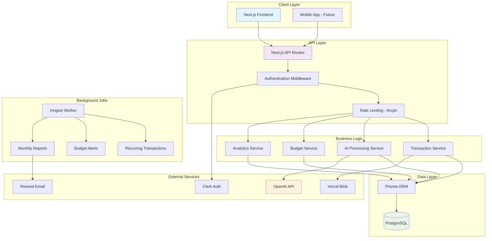
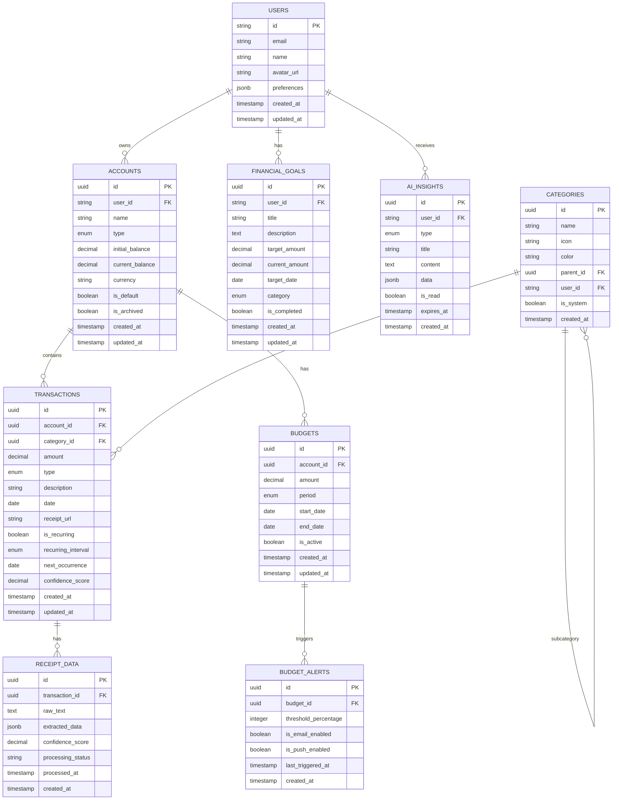
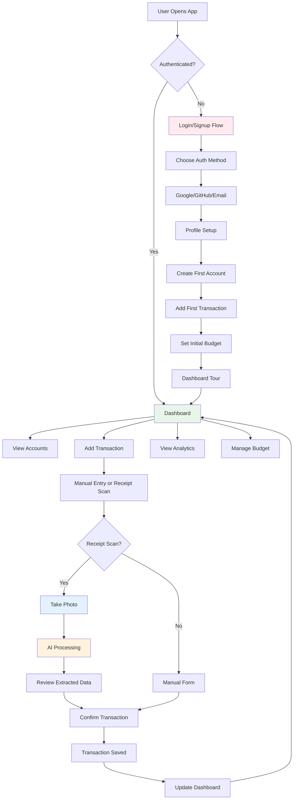
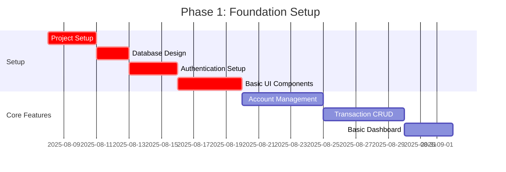
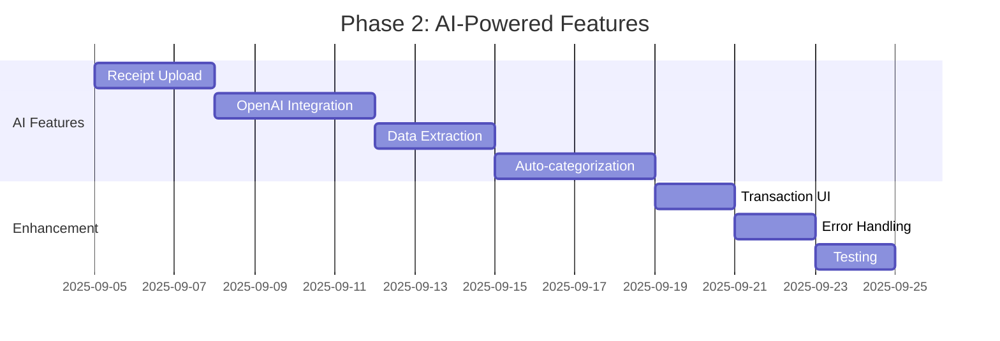
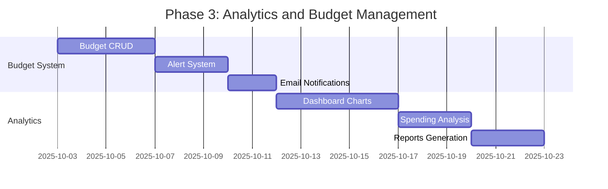
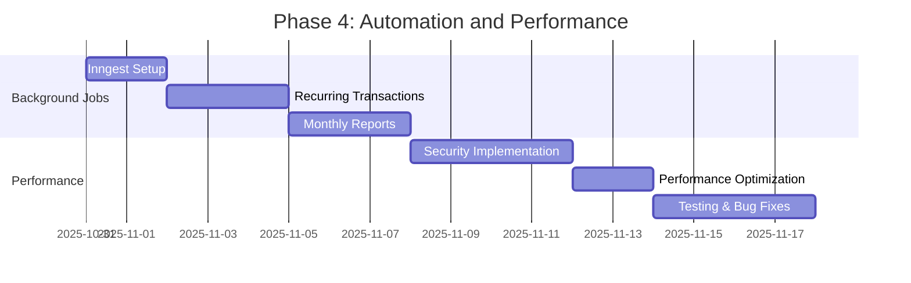

# Wealth AI Finance Platform - Product Requirements Document

## Executive Summary

**Product Name:** Wealth AI Finance Platform  
**Version:** 1.0  
**Document Date:** August 2025  
**Project Type:** Full-stack AI-powered personal finance management platform  
**Status:** In Development

### Vision Statement
To democratize personal finance management through AI-powered insights, automated transaction processing, and intelligent budgeting that helps users achieve financial wellness and build long-term wealth.

### Mission
Create an intuitive, secure, and comprehensive finance platform that eliminates manual transaction entry, provides personalized financial insights, and empowers users to make informed financial decisions through AI-driven analysis and recommendations.

## Implementation Status Overview

### Current Status: Foundation Phase
- ❌ Project Setup & Configuration
- ❌ Authentication System
- ❌ Database Schema Design
- ❌ Core UI Components
- ❌ MVP Features Implementation

## Product Overview

### Core Value Proposition
- **AI-Powered Receipt Scanning**: Eliminate manual transaction entry with intelligent OCR and data extraction
- **Smart Categorization**: Automatic transaction categorization with machine learning
- **Predictive Analytics**: AI-driven insights and personalized financial recommendations
- **Multi-Account Management**: Unified view across multiple financial accounts
- **Proactive Budget Management**: Real-time alerts and spending pattern analysis

### Target Audience
- **Primary**: Tech-savvy millennials and Gen-Z users (25-40 years)
- **Secondary**: Small business owners and freelancers
- **Tertiary**: Financial advisors managing multiple clients

## Technical Architecture

### Technology Stack Status

#### Frontend Stack
- ❌ **Next.js 14+** (App Router) - *Not implemented*
- ❌ **React 18+** - *Not implemented*
- ❌ **TypeScript** - *Not implemented*
- ❌ **Shadcn/ui** - *Not implemented*
- ❌ **Tailwind CSS** - *Not implemented*

#### Backend & Services
- ❌ **Clerk Authentication** - *Not implemented*
- ❌ **React Hook Form + Zod** - *Not implemented*
- ❌ **Inngest** (Background Jobs) - *Not implemented*
- ❌ **Arcjet** (Security) - *Not implemented*

#### Database & Storage
- ❌ **PostgreSQL** - *Not implemented*
- ❌ **Prisma ORM** - *Not implemented*
- ❌ **Vercel Blob** - *Not implemented*

#### AI & External Services
- ❌ **OpenAI GPT-4 Vision API** - *Not implemented*
- ❌ **Claude API** - *Not implemented*
- ❌ **Resend/SendGrid** - *Not implemented*

#### Deployment & Monitoring
- ❌ **Vercel** - *Not implemented*
- ❌ **Sentry** - *Not implemented*
- ❌ **PostHog** - *Not implemented*

### System Architecture



### Database Architecture



## Core Features Implementation Status

### 1. Authentication & User Management ❌
**Priority: P0** | **Status: Not Started**

#### Requirements
- ❌ Social login (Google, GitHub, Apple)
- ❌ Email/password authentication
- ❌ User profile management
- ❌ Account settings and preferences
- ❌ Session management and security

#### Technical Implementation
- ❌ Clerk integration for complete auth flow
- ❌ User metadata storage in PostgreSQL
- ❌ Role-based access control (future-ready)

### 2. Account Management ❌
**Priority: P0** | **Status: Not Started**

#### Requirements
- ❌ Create multiple financial accounts (Checking, Savings, Credit Card, etc.)
- ❌ Set one default account
- ❌ Account balance tracking
- ❌ Account type categorization
- ❌ Account archiving/deletion

#### Database Schema Implementation
```sql
-- Status: ❌ Not Created
accounts {
  id: uuid (PK)
  user_id: string
  name: string
  type: enum (checking, savings, credit_card, investment)
  initial_balance: decimal
  current_balance: decimal
  is_default: boolean
  currency: string
  created_at: timestamp
  updated_at: timestamp
}
```

### 3. AI-Powered Receipt Scanning ❌
**Priority: P0** | **Status: Not Started**

#### Requirements
- ❌ Upload receipt images (JPG, PNG, PDF)
- ❌ AI extraction of:
  - ❌ Amount
  - ❌ Date
  - ❌ Merchant name
  - ❌ Category suggestion
  - ❌ Description
- ❌ Manual override capabilities
- ❌ Confidence scoring for extracted data

#### Technical Implementation
- ❌ OpenAI GPT-4 Vision API integration
- ❌ Structured prompt engineering for consistent extraction
- ❌ Fallback to manual entry if confidence < 80%
- ❌ Image preprocessing for better OCR results

### 4. Transaction Management ❌
**Priority: P0** | **Status: Not Started**

#### Requirements
- ❌ Manual transaction creation
- ❌ AI-powered auto-categorization
- ❌ Bulk operations (select, delete, edit)
- ❌ Transaction search and filtering
- ❌ Recurring transaction setup
- ❌ Transaction history with pagination

### 5. Smart Categorization System ❌
**Priority: P0** | **Status: Not Started**

#### Requirements
- ❌ Pre-defined categories (Housing, Food, Transport, etc.)
- ❌ Custom category creation
- ❌ AI-powered auto-categorization
- ❌ Category-wise spending analysis
- ❌ Subcategory support

#### Category Structure Implementation Status
```
❌ Housing (Rent, Utilities, Maintenance)
❌ Food & Dining (Groceries, Restaurants, Takeout)
❌ Transportation (Gas, Public Transit, Uber)
❌ Entertainment (Movies, Games, Subscriptions)
❌ Shopping (Clothing, Electronics, Misc)
❌ Healthcare (Medical, Pharmacy, Insurance)
❌ Travel (Flights, Hotels, Activities)
❌ Education (Courses, Books, Training)
❌ Utilities (Phone, Internet, Insurance)
```

### 6. Budget Management ❌
**Priority: P0** | **Status: Not Started**

#### Requirements
- ❌ Set monthly budgets per account
- ❌ Real-time budget tracking
- ❌ Percentage-based alerts (75%, 90%, 100%)
- ❌ Budget vs. actual spending visualization
- ❌ Email notifications for budget alerts
- ❌ Historical budget performance

### 7. Dashboard & Analytics ❌
**Priority: P0** | **Status: Not Started**

#### Requirements
- ❌ Account overview cards
- ❌ Recent transactions feed
- ❌ Category-wise spending charts
- ❌ Income vs. expense visualization
- ❌ Time period filters (7 days, 1 month, 3 months, 6 months, 1 year)
- ❌ Key financial metrics display

#### Charts & Visualizations Status
- ❌ Donut chart for category breakdown
- ❌ Line chart for income/expense trends
- ❌ Bar chart for monthly comparisons
- ❌ Progress bars for budget tracking

### 8. Automated Background Jobs ❌
**Priority: P1** | **Status: Not Started**

#### Requirements
- ❌ Recurring transaction processing (daily cron)
- ❌ Budget alert monitoring (daily cron)
- ❌ Monthly financial report generation (monthly cron)
- ❌ Data cleanup and maintenance jobs
- ❌ Failed job retry mechanisms

### 9. AI-Powered Monthly Reports ❌
**Priority: P1** | **Status: Not Started**

#### Requirements
- ❌ Automated monthly email reports
- ❌ Personalized financial insights
- ❌ Spending pattern analysis
- ❌ Savings recommendations
- ❌ Goal tracking and progress
- ❌ Year-over-year comparisons

### 10. Security & Rate Limiting ❌
**Priority: P0** | **Status: Not Started**

#### Requirements
- ❌ API rate limiting (100 requests/hour per user)
- ❌ DDoS protection
- ❌ Bot detection and prevention
- ❌ SQL injection protection
- ❌ XSS protection
- ❌ CSRF protection

## Advanced Features (Post-MVP)

### Phase 2: Enhanced Analytics & AI ❌

#### 1. Advanced Financial Analytics ❌
- ❌ Cashflow forecasting
- ❌ Spending trend predictions
- ❌ Seasonal spending pattern detection
- ❌ Financial health scoring
- ❌ Debt-to-income ratio tracking
- ❌ Investment portfolio integration

#### 2. AI Financial Advisor ❌
- ❌ Personalized saving strategies
- ❌ Investment recommendations
- ❌ Debt payoff optimization
- ❌ Emergency fund calculations
- ❌ Retirement planning assistance
- ❌ Tax optimization suggestions

#### 3. Goal-Based Budgeting ❌
- ❌ SMART financial goals
- ❌ Goal progress tracking
- ❌ Automated savings allocation
- ❌ Milestone celebrations
- ❌ Goal sharing with family/partners

### Phase 3: Social & Collaboration Features ❌

#### 1. Family Finance Management ❌
- ❌ Family account sharing
- ❌ Kid allowance tracking
- ❌ Chore-based earning system
- ❌ Financial education modules
- ❌ Spending approval workflows

#### 2. Social Features ❌
- ❌ Anonymous spending comparisons
- ❌ Community challenges
- ❌ Leaderboards for savings
- ❌ Financial achievement badges
- ❌ Peer-to-peer money tips

### Phase 4: Advanced Integrations ❌

#### 1. Bank Account Integration ❌
- ❌ Plaid/Yodlee integration
- ❌ Automatic transaction import
- ❌ Real-time balance updates
- ❌ Multiple bank support
- ❌ Transaction reconciliation

#### 2. Investment Tracking ❌
- ❌ Stock portfolio monitoring
- ❌ Crypto asset tracking
- ❌ Real estate investment tracking
- ❌ ROI calculations
- ❌ Dividend tracking

#### 3. Bill Management ❌
- ❌ Bill reminder system
- ❌ Automatic bill categorization
- ❌ Bill negotiation suggestions
- ❌ Service cancellation tracking
- ❌ Subscription optimization

## User Experience & Interface Design

### Design Principles
- **Simplicity**: Clean, intuitive interface with minimal cognitive load
- **Accessibility**: WCAG 2.1 AA compliance, keyboard navigation, screen reader support
- **Responsiveness**: Mobile-first design, optimized for all screen sizes
- **Performance**: Fast loading times, optimistic UI updates
- **Consistency**: Unified design system across all components

### Key User Flows



### Implementation Status: User Flows
- ❌ Onboarding Flow
- ❌ Daily Transaction Flow
- ❌ Monthly Review Flow
- ❌ Receipt Scanning Flow
- ❌ Budget Management Flow

### Responsive Design Status
- ❌ Mobile: 320px - 768px
- ❌ Tablet: 768px - 1024px
- ❌ Desktop: 1024px+
- ❌ Large Desktop: 1440px+

## API Specifications

### Implementation Status: Core Endpoints

```typescript
// Account Management - Status: ❌ Not Implemented
❌ GET    /api/accounts              // List user accounts
❌ POST   /api/accounts              // Create new account
❌ GET    /api/accounts/:id          // Get specific account
❌ PUT    /api/accounts/:id          // Update account
❌ DELETE /api/accounts/:id          // Delete account
❌ PUT    /api/accounts/:id/default  // Set as default account

// Transaction Management - Status: ❌ Not Implemented
❌ GET    /api/transactions          // List transactions (with pagination, filters)
❌ POST   /api/transactions          // Create new transaction
❌ GET    /api/transactions/:id      // Get specific transaction
❌ PUT    /api/transactions/:id      // Update transaction
❌ DELETE /api/transactions/:id      // Delete transaction
❌ POST   /api/transactions/bulk-delete // Bulk delete transactions

// Receipt Processing - Status: ❌ Not Implemented
❌ POST   /api/receipts/scan         // Upload and process receipt
❌ GET    /api/receipts/:id          // Get processed receipt data

// Budget Management - Status: ❌ Not Implemented
❌ GET    /api/budgets               // List user budgets
❌ POST   /api/budgets               // Create new budget
❌ PUT    /api/budgets/:id           // Update budget
❌ DELETE /api/budgets/:id           // Delete budget

// Analytics - Status: ❌ Not Implemented
❌ GET    /api/analytics/overview    // Dashboard overview data
❌ GET    /api/analytics/spending    // Spending analysis by category/time
❌ GET    /api/analytics/trends      // Spending trends and patterns

// Categories - Status: ❌ Not Implemented
❌ GET    /api/categories            // List all categories
❌ POST   /api/categories            // Create custom category
❌ PUT    /api/categories/:id        // Update category
❌ DELETE /api/categories/:id        // Delete custom category

// AI Insights - Status: ❌ Not Implemented
❌ GET    /api/insights              // Get user insights
❌ POST   /api/insights/:id/read     // Mark insight as read
```

## Development Phases & Milestones

### Phase 1: Foundation (Weeks 1-4) ❌


**Deliverables:**
- ❌ Complete project setup with Next.js 14
- ❌ Database schema implementation
- ❌ Clerk authentication integration
- ❌ Basic UI component library
- ❌ Core CRUD operations for accounts and transactions

### Phase 2: AI Integration (Weeks 5-8) ❌


**Deliverables:**
- ❌ Receipt image upload functionality
- ❌ AI-powered data extraction
- ❌ Automatic transaction categorization
- ❌ Enhanced transaction management UI

### Phase 3: Analytics & Budgeting (Weeks 9-12) ❌


**Deliverables:**
- ❌ Complete budget management system
- ❌ Real-time budget alerts
- ❌ Comprehensive analytics dashboard
- ❌ Automated report generation

### Phase 4: Background Jobs & Optimization (Weeks 13-16) ❌


**Deliverables:**
- ❌ Automated background job processing
- ❌ Security implementations (Arcjet)
- ❌ Performance optimizations
- ❌ Comprehensive testing suite

## Performance Requirements

### Implementation Status: Performance Targets
- ❌ Page load time: < 2 seconds
- ❌ API response time: < 500ms (95th percentile)
- ❌ Receipt processing: < 10 seconds
- ❌ Database queries: < 100ms (95th percentile)

### Scalability Implementation Status
- ❌ Support 10,000 concurrent users
- ❌ Handle 1M transactions per day
- ❌ 99.9% uptime SLA
- ❌ Horizontal scaling capability

### Optimization Strategies Status
- ❌ Database indexing on frequently queried fields
- ❌ Redis caching for user sessions and frequent data
- ❌ CDN for static assets and images
- ❌ Image optimization and compression
- ❌ Lazy loading for non-critical components
- ❌ Database connection pooling
- ❌ API response caching

## Security & Privacy Implementation

### Data Protection Status
- ❌ End-to-end encryption for sensitive data
- ❌ PCI DSS compliance for payment data
- ❌ GDPR compliance for EU users
- ❌ Data retention policies (7 years for financial data)
- ❌ Regular security audits and penetration testing

### Authentication & Authorization Status
- ❌ Multi-factor authentication support
- ❌ Session management with automatic timeout
- ❌ Role-based access control (future-ready)
- ❌ API key management for integrations

### Privacy Controls Status
- ❌ User data export functionality
- ❌ Account deletion with complete data removal
- ❌ Opt-out mechanisms for AI processing
- ❌ Transparent privacy policy
- ❌ Cookie consent management

## Testing Strategy Implementation

### Test Coverage Status
- ❌ Unit tests: 90% code coverage target
- ❌ Integration tests for all API endpoints
- ❌ E2E tests for critical user flows
- ❌ Performance testing under load
- ❌ Security testing (OWASP Top 10)

### Testing Framework Status
- ❌ Jest + React Testing Library (Unit Testing)
- ❌ Supertest (Integration Testing)
- ❌ Playwright (E2E Testing)

### Continuous Integration Status
- ❌ Automated testing on every PR
- ❌ Code quality checks (ESLint, Prettier, TypeScript)
- ❌ Security scanning (Snyk, GitHub Security)
- ❌ Performance monitoring (Lighthouse CI)
- ❌ Automated deployment to staging environment

## Deployment & Operations

### Infrastructure Status
- ❌ **Hosting**: Vercel (frontend + API)
- ❌ **Database**: PlanetScale or Neon (PostgreSQL)
- ❌ **File Storage**: Vercel Blob or AWS S3
- ❌ **Email**: Resend
- ❌ **Monitoring**: Sentry (errors), PostHog (analytics)
- ❌ **Uptime Monitoring**: Better Uptime

### Environment Configuration Status
```bash
# Status: ❌ Not Configured
❌ DATABASE_URL=postgresql://...
❌ CLERK_SECRET_KEY=sk_...
❌ CLERK_PUBLISHABLE_KEY=pk_...
❌ OPENAI_API_KEY=sk-...
❌ INNGEST_EVENT_KEY=...
❌ INNGEST_SIGNING_KEY=...
❌ ARCJET_KEY=...
❌ RESEND_API_KEY=re_...
❌ BLOB_READ_WRITE_TOKEN=...
```

### Monitoring & Alerting Status
- ❌ Application performance monitoring (APM)
- ❌ Real-time error tracking and notifications
- ❌ Database performance monitoring
- ❌ API rate limiting and abuse detection
- ❌ Automated backup verification
- ❌ SSL certificate expiration monitoring

## Risk Assessment & Mitigation

### Technical Risks Status
| Risk | Impact | Probability | Mitigation | Status |
|------|--------|-------------|------------|---------|
| AI API rate limits | High | Medium | Implement caching, fallback to manual entry | ❌ Not Implemented |
| Database performance | High | Low | Proper indexing, query optimization, monitoring | ❌ Not Implemented |
| Third-party service downtime | Medium | Medium | Circuit breakers, fallback mechanisms | ❌ Not Implemented |
| Security breach | High | Low | Regular audits, penetration testing, encryption | ❌ Not Implemented |

### Business Risks Status
| Risk | Impact | Probability | Mitigation | Status |
|------|--------|-------------|------------|---------|
| Competitor launches similar feature | Medium | High | Focus on UX differentiation, rapid iteration | ❌ Strategy Not Defined |
| AI costs exceed budget | Medium | Medium | Cost monitoring, usage optimization | ❌ Not Implemented |
| Regulatory changes | High | Low | Legal consultation, compliance monitoring | ❌ Not Implemented |
| User adoption slower than expected | High | Medium | Enhanced onboarding, user research | ❌ Not Implemented |

## Implementation Roadmap

### Immediate Next Steps (Week 1)

```mermaid
flowchart LR
    A[Setup Next.js Project] --> B[Configure TypeScript]
    B --> C[Setup Tailwind CSS]
    C --> D[Install Shadcn/ui]
    D --> E[Configure Clerk Auth]
    E --> F[Setup Database]
    F --> G[Create Basic Layout]
    
    style A fill:#ffcdd2
    style B fill:#ffcdd2
    style C fill:#ffcdd2
    style D fill:#ffcdd2
    style E fill:#ffcdd2
    style F fill:#ffcdd2
    style G fill:#ffcdd2
```


### Priority Implementation Order
1. **Week 1-2**: ❌ Project setup, authentication, basic UI
2. **Week 3-4**: ❌ Account management, transaction CRUD
3. **Week 5-6**: ❌ AI receipt processing integration
4. **Week 7-8**: ❌ Budget management and alerts
5. **Week 9-10**: ❌ Analytics dashboard and charts
6. **Week 11-12**: ❌ Background jobs and automation
7. **Week 13-14**: ❌ Security hardening and testing
8. **Week 15-16**: ❌ Performance optimization and deployment

## Success Metrics & KPIs

### Planned Metrics (Not Yet Measurable)
- ❌ Daily Active Users (DAU)
- ❌ Monthly Active Users (MAU)
- ❌ User retention rates (1-day, 7-day, 30-day)
- ❌ Session duration and frequency
- ❌ Feature adoption rates
- ❌ Transaction volume per user per month
- ❌ Receipt scanning accuracy rate
- ❌ Budget adherence improvement

### Technical Metrics (Not Yet Implemented)
- ❌ API response time monitoring
- ❌ Error rate tracking
- ❌ Uptime monitoring
- ❌ Database performance metrics
- ❌ Background job success rate

## Conclusion

The Wealth AI Finance Platform represents an ambitious and comprehensive solution for modern personal finance management. This PRD outlines a clear path from the current "not started" state to a fully-featured AI-powered finance platform.

### Current Status Summary
- **Project Phase**: Pre-Development
- **Completion**: 0%
- **Next Milestone**: Project Setup and Foundation
- **Estimated MVP Delivery**: 16 weeks from start

### Key Success Factors
1. **Systematic Implementation**: Following the phased approach outlined
2. **AI-First Design**: Leveraging cutting-edge AI for user experience
3. **Security Focus**: Implementing robust security from day one
4. **User-Centric Development**: Focusing on intuitive user experience
5. **Scalable Architecture**: Building for future growth and features

The comprehensive roadmap ensures a structured approach to building a market-competitive fintech platform that will democratize personal finance management through intelligent automation and AI-powered insights.

---

**Document Status**: Living Document - To be updated as implementation progresses
**Last Updated**: August 8, 2025
**Next Review**: Weekly during development phases
